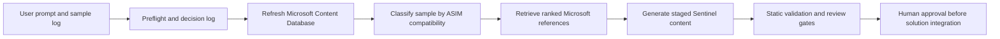

# Sentinel Content Forge Accelerator

## Prerequisites

- A local clone of the Azure-Sentinel repository, opened at its repository root in VS Code. The root must contain `Solutions/`, `Parsers/`, and `Tools/Sentinel-Content-Forge-Accelerator/`.
- Python 3.10 or later with `pip` available on the command line.
- GitHub Copilot Chat with agent mode enabled in VS Code.
- The two local Python dependencies used by the accelerator:

  ```powershell
  python -m pip install -r Tools/Sentinel-Content-Forge-Accelerator/requirements.txt
  ```

The lab runs locally. It does not require an Azure subscription, Azure credentials, a Function App, a deployment, or a connected Log Analytics workspace. Those are optional later validation environments, not prerequisites for the exercise.

## Here's the Prompt

Paste this into GitHub Copilot Chat from the Azure-Sentinel repository root to run the bundled lab:

```text
Load and follow Tools/Sentinel-Content-Forge-Accelerator/agent-instructions.md.
Use the synthetic sample data at Tools/Sentinel-Content-Forge-Accelerator/examples/network/contoso-edge-network-sample-events.jsonl.
Generate two analytic rules, two hunting queries, and one workbook.
Use only fields present in the sample data. Use a provisional source binding when no real connector or destination table is supplied. Stage the results for human review.
```

For your own log, replace the sample path and requested counts or content types:

```text
Load and follow Tools/Sentinel-Content-Forge-Accelerator/agent-instructions.md.
My sample data is at <workspace-relative-or-absolute-path>.
Generate <one or more analytic rules, hunting queries, and workbooks>.
```

For a source-specific draft, add the connector ID and destination table or parser name. Without them, the agent can still classify the sample, find reference content, and generate staged drafts. It labels the derived connector and data source as provisional until a human confirms them.

## What This Lab Is

The Sentinel Content Forge Accelerator is a local, agent-guided content-development lab. It accepts representative log data, determines the ASIM telemetry schemas that fit that data, finds relevant Microsoft-supported Sentinel content patterns, and produces original staged content for review.

The project is deliberately not a content deployment tool. It does not modify `Solutions/`, change solution manifests, deploy Azure resources, or create a pull request. It produces review-ready drafts and the evidence needed to decide whether they should later become solution content.

The wider Azure-Sentinel checkout contributes two read-only inputs:

- `Solutions/` supplies the Microsoft-supported, manifest-listed analytic rules, hunting queries, workbooks, parsers, and playbooks used as reference records.
- `Parsers/` supplies local ASIM parser evidence used to strengthen mappings between source-specific content and ASIM schemas.

### Bundled Sample Data

The lab prompt uses [contoso-edge-network-sample-events.jsonl](examples/network/contoso-edge-network-sample-events.jsonl), a synthetic JSONL edge-firewall log. Its companion [contoso-edge-network-content-request.json](examples/network/contoso-edge-network-content-request.json) documents the supported fields, requested artifact counts, and scenarios.

The sample contains normal traffic plus investigation-worthy behaviors:

- An external source probing multiple destination ports in a short interval.
- Repeated denied SSH attempts from an external source.
- Repeated low-volume HTTPS sessions suitable for a beaconing investigation.
- High-volume outbound HTTPS transfers to an external destination.

It has source and destination IP addresses, ports, protocol, action, direction, bytes, DNS query, URL, account, process, device, and policy-rule fields. That makes `NetworkSession` the primary expected ASIM compatibility result; DNS and web fields can support additional investigation views when their event semantics justify it.

## What Happens When You Run It

The sequence below mirrors [agent-instructions.md](agent-instructions.md). The agent refreshes the database before formal sample classification so reference lookup uses the exact state of the local repository the user opened.

1. **Submit a prompt.** The user gives the agent a representative sample-data path and requested artifact types or counts.
2. **Create the run context.** The agent verifies `yaml` and `jsonschema`, creates a timestamped `output/<run-id>/` directory, and starts `decision-log.md`.
3. **Refresh the Microsoft Content Database.** The agent rebuilds the local runtime database from the current checkout, maps each retrieval-relevant Microsoft-supported asset to a best-fit ASIM schema, and checks the refresh report.
4. **Classify the log and retrieve examples.** The agent inspects the submitted fields and behavior, writes `classification.json`, and retrieves confidence-ranked Microsoft reference records for the compatible ASIM schemas.
5. **Generate new content.** The agent writes only the requested analytic rules, hunting queries, and workbooks under the staged run directory. It records the exact sample fields and references used for every artifact.
6. **Validate and review.** The agent runs deterministic static validation, repairs local failures, lists remaining manual checks, and leaves the result staged for human approval.



## Stage 1: Refresh the Microsoft Content Database

The Microsoft Content Database is an index of Microsoft-supported Sentinel reference content, not a copy of the source files and not a collection of user sample data. Every record points back to its original `Solutions/...` path and stores the data needed to decide whether it is a useful pattern for the submitted log.

The agent calls [scripts/refresh_database.py](scripts/refresh_database.py) before sample classification and retrieval so lookup reflects the current local checkout. It does not run `git pull`, change branches, or modify `Solutions/`.

### Inputs and Admission Rules

The refresh script reads these source-controlled inputs:

| Input | Why the script needs it |
|---|---|
| `Solutions/*/SolutionMetadata.json` | Identifies each solution and its support tier. |
| `Solutions/*/Data/Solution_*.json` | Identifies the exact assets that belong to a solution package. |
| [database/selection-policy.yaml](database/selection-policy.yaml) | Defines source locations, manifest keys, file extensions, and the Microsoft-only admission rule. |
| [database/taxonomy.yaml](database/taxonomy.yaml) | Defines canonical ASIM schemas, signal groups, fallback rules, weights, and thresholds. |
| [database/asim-mapping-registry.yaml](database/asim-mapping-registry.yaml) | Supplies reviewed, narrow mappings that are stronger than generic content inference. |
| `Parsers/ASim*/Parsers/` | Provides local ASIM parser evidence referenced by reviewed mapping rules. |

An asset enters the database only when both conditions are true:

1. Its solution metadata declares `support.tier: Microsoft`.
2. Its path is listed in that solution's `Data/Solution_*.json` manifest.

This keeps Partner and Community content out of the retrieval set. It also prevents the refresh from treating an arbitrary file in a solution directory as a trusted reference. Eligible content types are analytic rules, hunting queries, workbooks, parsers, and playbooks. Playbooks are retained for traceability but are not used as telemetry references.

### What the Refresh Script Does

Run the script from the Azure-Sentinel repository root:

```powershell
python Tools/Sentinel-Content-Forge-Accelerator/scripts/refresh_database.py `
  --repo-root <repository-root>
```

The script performs these deterministic operations:

1. Scans every solution metadata file and retains only Microsoft-supported solutions.
2. Finds `Data` or `data` manifest directories and resolves manifest-listed paths relative to the solution, `Solutions/`, or repository root.
3. Reads eligible YAML and JSON content files and extracts source path, hash, content type, title, connector IDs, data types, ASIM function references, MITRE metadata, and entity types.
4. Validates each normalized record against [schemas/database-record.schema.json](schemas/database-record.schema.json).
5. Adds ASIM retrieval labels, evidence, mapping status, and confidence to every analytic rule, hunting query, workbook, and parser.
6. Writes a JSONL database plus `refresh-report.json`, including warnings, errors, mapping counts, and confidence counts.

The normal output is intentionally local and ignored by Git:

```text
Tools/Sentinel-Content-Forge-Accelerator/database/runtime/
  microsoft-content-database.jsonl
  refresh-report.json
```

The versioned fallback snapshot lives under [database/baseline/](database/baseline/). The query script uses runtime data when it exists and falls back to the baseline only when a runtime database has not been created. Rebuilding the baseline is a maintainer action described near the end of this README.

### ASIM Mapping for Retrieval

The Microsoft Content Database uses canonical ASIM schemas as its retrieval categories:

- `AlertEvent`
- `AuditEvent`
- `Authentication`
- `DhcpEvent`
- `Dns`
- `FileEvent`
- `NetworkSession`
- `ProcessEvent`
- `RegistryEvent`
- `UserManagement`
- `WebSession`
- `AgentEvent`
- `AssetEntity`

Each record stores one or more `asimSchemas`, its `mappingStatus`, `retrievalConfidence`, and the evidence that supports the mapping. Solution metadata domains remain stored as context and provenance. They are used only as a low-confidence last-resort signal when source-specific evidence is unavailable.

The refresh uses this precedence for database records:

1. **Direct ASIM evidence:** An ASIM function reference, schema tag, or parser-like identifier produces an `explicit` mapping with `exact` confidence.
2. **Reviewed source-specific evidence:** A narrow rule in `asim-mapping-registry.yaml` produces `inferredFromRepository` or `inferredFromOfficialProductDocumentation` with `high` confidence.
3. **Deterministic content inference:** The taxonomy scores source-table and connector terms, field names, raw text, title and path terms, and supporting entity types. This produces `inferredFromContent` with `high`, `medium`, or `low` confidence.
4. **Controlled fallbacks:** When source content lacks stronger signals, solution metadata and then content type assign a low-confidence retrieval label. This keeps the reference discoverable without presenting it as normalized ASIM telemetry.
5. **Non-telemetry content:** Deployment playbooks are always `notApplicable` and are excluded from telemetry retrieval.

The scoring rules live in `retrievalInference` inside [database/taxonomy.yaml](database/taxonomy.yaml). The current weights are `sourceTerm: 8`, `fieldTerm: 4`, `textTerm: 3`, `titlePathTerm: 2`, and `entityType: 1`, with at most two matching terms per signal group. A score of at least `8` is high confidence, a score of at least `5` is medium confidence, and a lower nonzero score is low confidence. The first schema is the best-fit primary retrieval schema; a second schema is retained only when its score is close enough to the primary schema and clears the secondary threshold.

Mapping states are explicit:

- `explicit`: The artifact directly uses an ASIM parser, schema tag, or parser name.
- `inferredFromRepository`: An approved local mapping relates the artifact's source table and selectors to a local ASIM parser.
- `inferredFromOfficialProductDocumentation`: A reviewed mapping uses official vendor documentation after local repository evidence was insufficient.
- `inferredFromContent`: A deterministic best-effort mapping uses source tables, connector IDs, KQL or workbook fields, titles, paths, entities, and, only as a last resort, solution metadata or content type.
- `ambiguous`: More than one ASIM schema is plausible.
- `unmapped`: No defensible ASIM mapping is available.
- `notApplicable`: The artifact is not telemetry content, such as a deployment-only playbook.

`retrievalConfidence` describes the strength of the retrieval label: `exact` is direct ASIM evidence, `high` is strong table or parser-family evidence, `medium` is multiple corroborating content signals, and `low` is a useful but weak fallback. Confidence is a retrieval-ranking signal, not a statement that the source is ASIM normalized.

Every analytic rule, hunting query, workbook, and parser in the current database receives at least one best-fit ASIM retrieval label. Playbooks remain `notApplicable` because they are deployment automation rather than source telemetry. `unmapped` is preserved for future content only when no meaningful fallback can be established.

### Optional Mapping Research

The accelerator first uses local artifact content, connector definitions, and the ASIM parser library under `Parsers/`. For example, Palo Alto PAN-OS traffic content that uses `CommonSecurityLog`, `Palo Alto Networks`, and `TRAFFIC` can be mapped to `NetworkSession` through the local Palo Alto CEF ASIM parser.

When that local evidence is insufficient, a user can explicitly enable official vendor documentation research in `context.productResearch`. The agent records the URLs and conclusion in the run decision log, then creates a reviewable mapping proposal. Product-documentation research never automatically changes runtime classification; only reviewed entries in `database/asim-mapping-registry.yaml` with `reviewState: approved` apply during refresh.

## Stage 2: Classify the Submitted Log and Retrieve References

This stage uses the refreshed database to find examples that fit the incoming log. It has two different classification activities that should not be confused:

- **Sample classification** asks which ASIM schema or schemas the user's data can support. Its output is `classification.json`.
- **Database classification** has already labeled every reference asset for retrieval. Its labels, confidence, and evidence decide the order in which reference patterns are presented.

### Normalize the Request

The agent records the incoming request in `output/<run-id>/content-request.json` and validates it against [schemas/content-request.schema.json](schemas/content-request.schema.json). It records the sample path and format, requested content types, optional field descriptions, known scenarios, ASIM hints, and source binding.

The source binding is deliberately optional at intake:

| Binding status | Meaning | What happens next |
|---|---|---|
| `provided` | The user supplied a real connector ID and table or parser. | Generated content uses it unchanged. |
| `unbound` | The user supplied only sample data. | Classification and retrieval continue. Generation derives a clearly labeled provisional binding. |
| `provisional` | The agent derived draft connector and data-source names from the sample context. | Content remains staged until a human confirms or replaces the binding. |

### Classify the Log by ASIM Compatibility

The agent follows [instructions/classify-and-retrieve.md](instructions/classify-and-retrieve.md) and writes `classification.json` using [schemas/classification.schema.json](schemas/classification.schema.json). This is an evidence-based compatibility decision, not a requirement that the raw log already be normalized.

| Observed sample evidence | Likely ASIM compatibility |
|---|---|
| Source and destination IP addresses, ports, protocols, bytes, direction, and firewall action | `NetworkSession` |
| DNS queries, DNS response values, or DNS server events | `Dns` |
| HTTP methods, URL, status, user agent, or proxy and WAF activity | `WebSession` |
| User sign-ins, authentication results, MFA, or logon type | `Authentication` |
| User, group, role, and permission lifecycle changes | `UserManagement` |
| Process command lines or process start and termination events | `ProcessEvent` |
| File creation, hashes, uploads, downloads, or storage-object activity | `FileEvent` |
| Registry keys and registry value changes | `RegistryEvent` |
| Alert summary and provider finding records | `AlertEvent` |
| Administrative and control-plane activity | `AuditEvent` |

For the bundled firewall sample, `SrcIpAddr`, `DstIpAddr`, ports, protocol, direction, action, and byte counts provide direct evidence for `NetworkSession`. `DnsQuery` and `Url` can be considered for DNS and web investigation views, but the agent should only select them when their event semantics are useful for the requested content.

Sample-data `mappingStatus` is one of `explicit`, `compatible`, `ambiguous`, `unmapped`, or `notApplicable`. Raw sample data is normally `compatible`, not `explicit`, unless the user supplied an actual ASIM parser or schema declaration. If the sample is `unmapped` or `ambiguous`, the agent stops before generation and explains the evidence gap. It can use official vendor documentation only when the user explicitly enables product research or asks for it. Any resulting mapping is a reviewable proposal, not an automatic registry change.

### Retrieve Reference Patterns

The agent calls [scripts/query_database.py](scripts/query_database.py) for each requested content type. The script validates requested ASIM schema IDs against `taxonomy.yaml`, selects the runtime database when available, validates each JSONL record against the database-record schema, filters to Microsoft-supported records whose `asimSchemas` contain the requested schema, and writes JSON containing the matching and returned record counts plus the selected records.

For the lab's network-session analytic-rule examples, the command is:

```powershell
python Tools/Sentinel-Content-Forge-Accelerator/scripts/query_database.py `
  --asim-schema NetworkSession `
  --content-type analyticRule `
  --limit 12 `
  --output Tools/Sentinel-Content-Forge-Accelerator/output/<run-id>/references-analyticRule.json
```

Repeat the query for `huntingQuery` and `workbook`, changing the output filename each time. The script orders matches by mapping strength: direct ASIM mappings, reviewed mappings, then content inferences from high through low confidence. Within a record, a match on the requested primary schema ranks ahead of a secondary-schema match.

The agent reads the original `sourcePath` files for the strongest and most scenario-relevant results. It chooses only the few references that improve the requested artifacts. A low-confidence reference can provide a formatting or visualization pattern, but it cannot by itself justify an ASIM parser claim, a production connector name, or an invented source field.

## Stage 3: Generate New Sentinel Content

Generation is agent-directed rather than a separate generator script. The agent follows [instructions/generate-sentinel-content.md](instructions/generate-sentinel-content.md), reads the selected `references-*.json` files and original source artifacts, and writes original content that uses only fields available in the submitted sample.

For the bundled sample, reasonable candidates include an external multi-port scan analytic rule, a repeated denied SSH analytic rule or hunt, a beaconing hunt, a high-volume outbound transfer hunt, and a network investigation workbook. The agent chooses only scenarios supported by observed sample data and the requested counts. It must omit unsupported ideas rather than fabricate fields or event values.

The generated run has this structure:

```text
Tools/Sentinel-Content-Forge-Accelerator/output/<run-id>/
  content-request.json              # Normalized user input and binding status
  classification.json               # Sample-data ASIM compatibility decision
  references-analyticRule.json      # Ranked Microsoft reference records, when requested
  references-huntingQuery.json      # Ranked Microsoft reference records, when requested
  references-workbook.json          # Ranked Microsoft reference records, when requested
  content/
    Analytic Rules/                 # New staged analytic-rule YAML files
    Hunting Queries/                # New staged hunting-query YAML files
    Workbooks/                      # New staged workbook JSON files
  generation-evidence.json          # Fields and reference paths used per artifact
  validation-report.json            # Static-validation results
  decision-log.md                   # Human-readable decisions and remaining gates
```

The agent validates `generation-evidence.json` with [schemas/generation-evidence.schema.json](schemas/generation-evidence.schema.json). Each generated artifact must name its purpose, sample fields, and selected Microsoft reference paths. `decision-log.md` records why a reference was selected, its mapping status and confidence, the generated scenario, and any omitted scenario.

Generated analytic rules use valid IDs, severity, schedules, MITRE tactics and techniques, data connector declarations, and entity mappings. Hunting queries use original KQL and investigation-ready fields. Workbooks use the `Notebook/1.0` format, a `sentinel-` template ID, a useful time range, and multiple focused views when the sample supports them.

The agent never copies an entire reference artifact. It uses reference content for patterns and scenarios while deriving KQL, field use, and source binding from the submitted sample. It does not write generated files to `Solutions/` or modify a solution manifest.

## Stage 4: Validate, Repair, and Review

The agent calls [scripts/validate_output.py](scripts/validate_output.py) after generation because a syntactically plausible draft is not necessarily a usable Sentinel artifact. The script reads staged YAML and JSON files plus the normalized content request, validates them against the relevant accelerator contracts, and writes a structured report.

```powershell
python Tools/Sentinel-Content-Forge-Accelerator/scripts/validate_output.py `
  --input Tools/Sentinel-Content-Forge-Accelerator/output/<run-id>/content `
  --request Tools/Sentinel-Content-Forge-Accelerator/output/<run-id>/content-request.json `
  --report Tools/Sentinel-Content-Forge-Accelerator/output/<run-id>/validation-report.json
```

The static validator checks YAML or JSON syntax, file extension, required fields, GUID and semantic-version formats, MITRE tactic and technique format, analytic-rule schedule settings, connector and data-source consistency, KQL presence, entity mappings, and basic workbook structure. It validates the result with [schemas/validation-report.schema.json](schemas/validation-report.schema.json).

It does not execute KQL against a workspace, verify actual connector deployment, or render a workbook. Those remain human or test-workspace checks. A `failed` result means a deterministic defect must be repaired. `needsReview` is expected when static checks pass but execution, rendering, usefulness, or provisional source binding still requires a human decision.

The agent appends each validation, repair, and rerun to `decision-log.md`. The run is ready for human review only when it has zero failed checks, generation evidence, selected references, the classification, the request, and a clear list of unperformed checks. It never publishes the content automatically.

## Project Reference

The chronological stages above explain when each component is used. This section is a file-by-file reference for maintainers who need to understand or improve a particular part of the lab.

### Root Files

| Path | Purpose | Changed during a normal run? |
|---|---|---|
| [README.md](README.md) | Explains the component, its lifecycle, and its operational contracts. | No |
| [agent-instructions.md](agent-instructions.md) | The root Copilot workflow: preflight, refresh, classification, retrieval, generation, validation, and final reporting. | No |
| [requirements.txt](requirements.txt) | Pins the two Python runtime dependencies used by local scripts. | No |
| [.gitignore](.gitignore) | Keeps regenerated runtime database files, staged output, and Python bytecode out of Git. | No |

### Workflow Runbooks

The root agent loads these files in order. They are instructions for the generating agent, not executable scripts.

| File | What it controls |
|---|---|
| [instructions/update-microsoft-content-database.md](instructions/update-microsoft-content-database.md) | Refreshes the local database from qualifying `Solutions/` content and records refresh counts in the decision log. |
| [instructions/classify-and-retrieve.md](instructions/classify-and-retrieve.md) | Assesses sample-data ASIM compatibility, runs ASIM-schema retrieval, and records selected and rejected references. |
| [instructions/generate-sentinel-content.md](instructions/generate-sentinel-content.md) | Creates original staged analytic rules, hunts, and workbooks using only supported sample fields and selected reference patterns. |
| [instructions/validate-sentinel-content.md](instructions/validate-sentinel-content.md) | Runs static validation, repairs deterministic failures, and preserves validation history. |
| [instructions/document-run-decisions.md](instructions/document-run-decisions.md) | Defines the required human-readable `decision-log.md` for every generation run. |
| [instructions/classify-existing-asim-content.md](instructions/classify-existing-asim-content.md) | Guides maintainers through local evidence review and optional official product-documentation research for a new ASIM mapping proposal. |

### Database

The database is a JSONL index of trusted reference files, not a copy of Sentinel content. The source file remains under `Solutions/`; each record preserves its workspace-relative source path, source hash, content metadata, ASIM evidence, and mapping status.

| Path | Purpose | Lifecycle |
|---|---|---|
| [database/selection-policy.yaml](database/selection-policy.yaml) | Defines the Microsoft-only admission rule, manifest locations, indexed content types, and runtime/baseline paths. | Source-controlled policy |
| [database/taxonomy.yaml](database/taxonomy.yaml) | Lists canonical ASIM schema IDs, aliases, retrieval signal terms, scoring weights, confidence thresholds, and controlled fallback mappings. | Source-controlled taxonomy |
| [database/asim-mapping-registry.yaml](database/asim-mapping-registry.yaml) | Holds reviewed, narrow mappings from source-specific reference content to ASIM schemas. Only `reviewState: approved` entries affect refresh. | Source-controlled registry |
| [database/asim-mapping-proposals/README.md](database/asim-mapping-proposals/README.md) | Explains how to submit a reviewable proposal without changing runtime classification. | Source-controlled guidance |
| [database/baseline/](database/baseline/) | Versioned database snapshot and refresh report available immediately after cloning. The report includes mapping and confidence counts. | Maintainer-managed |
| `database/runtime/` | Rebuilt JSONL database and refresh report for the current local checkout. The report includes mapping and confidence counts. | Ignored and regenerated per run |

Database inclusion and ASIM classification are intentionally separate. `support.tier: Microsoft` and manifest membership decide inclusion. ASIM classification makes every telemetry-relevant reference retrievable; its status, evidence, and confidence show how strongly the reference belongs to that ASIM schema.

### ASIM Taxonomy and Mapping States

`database/taxonomy.yaml` contains ASIM schema IDs and the retrieval-inference configuration. These are telemetry normalization categories such as `Authentication`, `NetworkSession`, and `ProcessEvent`. They are different from the JSON Schema contract files in `schemas/` described later.

During refresh, the accelerator looks for direct parser references, schema tags, or parser-like names. When those are absent, it can apply a narrowly approved registry rule that identifies a specific event family. It never treats an entire vendor or solution as one global ASIM schema.

| Mapping status | Meaning | Retrieval behavior |
|---|---|---|
| `explicit` | The artifact directly names an ASIM parser, schema tag, or parser-like identifier. | Returned for its declared schema. |
| `inferredFromRepository` | An approved registry rule links the artifact to local ASIM parser evidence. | Returned after explicit references. |
| `inferredFromOfficialProductDocumentation` | A reviewed registry rule relies on official vendor documentation after local evidence was insufficient. | Returned after repository inferences. |
| `inferredFromContent` | Best-fit mapping from deterministic table, field, text, title/path, entity, metadata, or content-type signals. | Returned after reviewed mappings and ordered by confidence. |
| `ambiguous` | Multiple plausible schema mappings remain. | Retained and shown after stronger mappings. |
| `unmapped` | No defensible ASIM mapping exists. | Retained, but omitted from schema retrieval. |
| `notApplicable` | The asset is not telemetry content, such as a deployment-only playbook. | Retained, but omitted from schema retrieval. |

The query script orders results by mapping status, then `retrievalConfidence`, then whether the requested ASIM schema is primary or secondary. Generation should prefer exact, high, and medium-confidence references for behavioral patterns; use low-confidence references only when their source fields and security scenario fit the sample data.

### JSON Contract Schemas

The files in `schemas/` use JSON Schema Draft 2020-12. They validate accelerator-owned data exchanged between stages. They do not define the ASIM telemetry schema itself.

| File | Validates |
|---|---|
| [schemas/content-request.schema.json](schemas/content-request.schema.json) | The normalized user request, requested artifact types, optional ASIM hints, source-binding state, and opt-in product research settings. |
| [schemas/classification.schema.json](schemas/classification.schema.json) | The agent's ASIM compatibility assessment for submitted sample data, including evidence and `compatible`, `unmapped`, or `ambiguous` outcomes. |
| [schemas/database-record.schema.json](schemas/database-record.schema.json) | Each JSONL reference record produced by database refresh, including ASIM schemas, mapping status, confidence, and evidence. |
| [schemas/generation-evidence.schema.json](schemas/generation-evidence.schema.json) | The link from each generated artifact to sample fields and selected `Solutions/` references. |
| [schemas/validation-report.schema.json](schemas/validation-report.schema.json) | The structured static-validation report, check outcomes, and manual-review gates. |

### Python Scripts

Every Python script begins with a short purpose comment. Run executable scripts from the Azure-Sentinel repository root so relative paths resolve predictably.

| Script | Inputs | Output and role |
|---|---|---|
| [scripts/refresh_database.py](scripts/refresh_database.py) | Local `Solutions/`, selection policy, ASIM taxonomy, and approved mapping registry. | Produces validated JSONL database records and a refresh report. It enforces manifest membership, Microsoft support tier, and ASIM mapping precedence. |
| [scripts/query_database.py](scripts/query_database.py) | A runtime or baseline JSONL database, canonical `--asim-schema` values, and optional content-type filters. | Validates database records, filters references by schema and content type, and returns them in mapping-strength order. |
| [scripts/validate_output.py](scripts/validate_output.py) | Staged analytic-rule, hunting-query, or workbook files and an optional content request. | Writes a structured report covering file structure, dependencies, KQL presence, MITRE fields, entity mappings, and manual-review gates. It does not execute KQL or render workbooks. |
| [scripts/schema_utils.py](scripts/schema_utils.py) | A JSON document and one of the contract schemas. | Shared `Draft202012Validator` and `FormatChecker` helper used by refresh, retrieval, validation, and tests. It has no standalone command-line workflow. |

Common commands:

```powershell
# Rebuild the ignored local working database.
python Tools/Sentinel-Content-Forge-Accelerator/scripts/refresh_database.py --repo-root <repository-root>

# Retrieve Network Session hunting-query reference patterns.
python Tools/Sentinel-Content-Forge-Accelerator/scripts/query_database.py `
  --asim-schema NetworkSession `
  --content-type huntingQuery

# Statically validate files generated for a staged run.
python Tools/Sentinel-Content-Forge-Accelerator/scripts/validate_output.py `
  --input Tools/Sentinel-Content-Forge-Accelerator/output/<run-id>/content `
  --request Tools/Sentinel-Content-Forge-Accelerator/output/<run-id>/content-request.json `
  --report Tools/Sentinel-Content-Forge-Accelerator/output/<run-id>/validation-report.json
```

### Examples

`examples/` holds synthetic inputs and deliberately invalid fixtures. It lets maintainers exercise the workflow without customer data.

| Area | Contents | Intended use |
|---|---|---|
| `examples/network/` | Azure DDoS and Contoso Edge JSONL event samples with matching content requests. | Demonstrates network telemetry, sample-only intake, and provisional binding. |
| `examples/identity-authentication/` | Fabrikam Identity Hub JSONL events and a matching content request. | Demonstrates authentication-oriented sample classification. |
| `examples/cloud-audit/` | Fabrikam Cloud Control JSONL audit events and a matching content request. | Demonstrates cloud control-plane auditing, role changes, credential creation, audit tampering, data export, and remediation scenarios. |
| `examples/validation/` | A deliberately invalid analytic rule. | Confirms that static validation reports deterministic failures. |

### Tests

[tests/test_accelerator.py](tests/test_accelerator.py) is the focused regression suite. It verifies seven high-value contracts:

1. Only manifest-listed content from Microsoft-supported solutions is indexed, and refreshed records use the strict ASIM v2 classification shape.
2. An approved ASIM mapping applies only when all of its source and event selectors match; the Palo Alto traffic example must not match a non-traffic event.
3. Best-effort inference uses source-table and metadata evidence, avoids generic JSON property false positives, and keeps playbooks `notApplicable`.
4. Static validation distinguishes a well-formed analytic rule from a deliberately invalid one.
5. A sample-only request may remain unbound while explicitly opting in to official product-documentation research.
6. Retrieval uses the runtime database when it exists and otherwise falls back to the baseline snapshot.
7. Retrieval ranks direct and reviewed mappings ahead of high- and low-confidence content inferences.

Run the suite from the repository root:

```powershell
python -m unittest Tools/Sentinel-Content-Forge-Accelerator/tests/test_accelerator.py -v
```

The suite validates local behavior only. KQL execution against a Log Analytics workspace, workbook rendering, connector deployment, solution packaging, and pull-request submission remain human or environment-specific gates.

### Staged Output and Review

Every generation run receives a unique directory under ignored `output/<run-id>/`. A complete run normally contains:

```text
output/<run-id>/
  content-request.json          # Normalized input and source-binding state
  classification.json           # Sample-data ASIM compatibility decision
  references-*.json             # Retrieved Microsoft reference records
  content/
    Analytic Rules/             # Generated analytic rules, when requested
    Hunting Queries/            # Generated hunting queries, when requested
    Workbooks/                  # Generated workbooks, when requested
  generation-evidence.json      # Fields and reference paths used per artifact
  validation-report.json        # Static validation outcome
  decision-log.md               # Human-readable narrative of every decision
```

Generation is not publication. A human must review the staged content, confirm any provisional source binding, run appropriate environment-specific checks, and then decide whether to integrate it into a Sentinel solution. The accelerator never copies output into `Solutions/`, changes a manifest, deploys resources, or creates a pull request.

## Baseline Maintenance

Maintainers intentionally rebuild and review the baseline Microsoft Content Database when publishing a new accelerator snapshot. Routine end-user requests refresh only the ignored local runtime database.

```powershell
python Tools/Sentinel-Content-Forge-Accelerator/scripts/refresh_database.py `
  --repo-root <repository-root> `
  --output Tools/Sentinel-Content-Forge-Accelerator/database/baseline/microsoft-content-database.jsonl `
  --report Tools/Sentinel-Content-Forge-Accelerator/database/baseline/refresh-report.json
```

For a low- or medium-confidence mapping, an unexpected `unmapped` artifact, or a source family that needs a stronger reviewed rule, use [instructions/classify-existing-asim-content.md](instructions/classify-existing-asim-content.md). Start with local content, connector definitions, and ASIM parsers. Use official vendor documentation only when explicitly enabled or requested, write a narrow proposal under `database/asim-mapping-proposals/`, and promote it to the registry only after review.

## Contribution Notes

Contributions should improve either reference retrieval quality, generated-content quality, deterministic validation, or the lab experience. Keep the distinction between a best-fit retrieval label and a confirmed ASIM-normalized source: every change should preserve visible evidence and confidence rather than silently making a weak mapping look exact.

### Improve ASIM Retrieval Quality

The primary place to tune classification is [database/taxonomy.yaml](database/taxonomy.yaml).

- Adjust `retrievalInference.scoring` when a signal type should count more or less strongly. The current weights favor source-table and connector signals over field, text, title, and entity hints.
- Adjust `retrievalInference.thresholds` to change the boundary between `high`, `medium`, and `low` confidence or the rules for retaining a second ASIM schema.
- Add or refine `retrievalSignals` under an individual ASIM schema. Prefer precise source-table, connector, or field terms over generic words that might occur in unrelated JSON or descriptions.
- Review `metadataDomainFallbacks` and `contentTypeFallbacks` cautiously. They are deliberately low-confidence fallbacks used only when stronger source evidence is unavailable.
- Add a focused regression case in [tests/test_accelerator.py](tests/test_accelerator.py) for every new signal, especially a nearby nonmatching case that could reveal a false positive.

### Add a Reviewed Source-Specific Mapping

Use [instructions/classify-existing-asim-content.md](instructions/classify-existing-asim-content.md) when a product, connector, table, or event family deserves more confidence than a generic content inference. Create a narrow proposal under [database/asim-mapping-proposals/](database/asim-mapping-proposals/), document local parser or official vendor evidence, and include explicit false-positive boundaries. Only an entry with `reviewState: approved` in [database/asim-mapping-registry.yaml](database/asim-mapping-registry.yaml) affects refresh behavior.

Do not add a vendor-wide mapping merely because one event family fits an ASIM schema. For example, one product can produce network, authentication, audit, and alert events that require different mappings.

### Improve Generated Content

[agent-instructions.md](agent-instructions.md) controls the end-to-end agent workflow. The files under [instructions/](instructions/) control the detailed behavior for database refresh, sample classification and retrieval, content generation, validation, decision logging, and mapping research. Improve these instructions when the agent needs clearer decisions, stronger evidence requirements, better reference selection, or more useful analyst-facing output.

Changes to generated-content guidance should preserve these rules:

- Use only fields present in the sample data or explicitly supplied by the user.
- Generate original artifacts instead of copying a reference rule, hunt, or workbook.
- Keep provisional connector and data-source bindings visibly provisional.
- Use a source-agnostic ASIM parser in generated KQL only when explicit or approved mapping evidence establishes it.
- Update the decision-log guidance when a new decision or review gate needs to be visible to a human reviewer.

### Improve Validation and Contracts

Update [scripts/validate_output.py](scripts/validate_output.py) when a deterministic artifact check is missing. Update the corresponding contract under [schemas/](schemas/) when an accelerator-owned JSON file gains or changes fields. Add or update focused tests for every behavior change. The validator should remain honest about what it does not perform: KQL execution, connector deployment, and workbook rendering require a test workspace or human review.

### Improve the Lab Inputs

Add synthetic JSONL, JSON, CSV, or text samples under [examples/](examples/) when a new telemetry family needs a reproducible exercise. Include a matching content request that names supported fields, intended ASIM compatibility, requested artifact types, and scenarios grounded in the sample. Do not add customer data or credentials to examples.

### Validate and Publish Changes

Run the focused suite after changes to scripts, schemas, taxonomy, mapping rules, or instructions:

```powershell
python -m unittest Tools/Sentinel-Content-Forge-Accelerator/tests/test_accelerator.py -v
```

When changing database-generation behavior, rebuild the ignored runtime database first and inspect its `refresh-report.json` coverage and confidence counts. Rebuild the versioned baseline only when intentionally publishing a new snapshot. Confirm that every analytic rule, hunting query, workbook, and parser has a usable ASIM retrieval mapping, that playbooks remain `notApplicable`, and that representative `query_database.py` calls return the expected ranking.